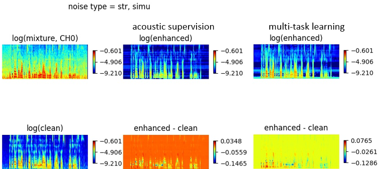
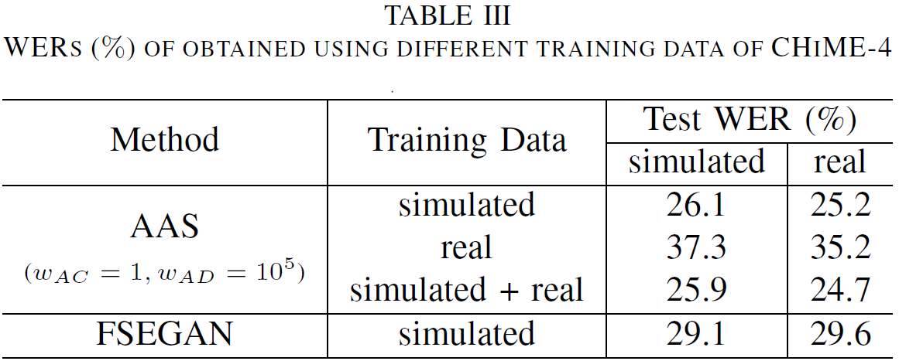

# AAS_enhancement
This repository contains the code and supplementary result for the paper "Unpaired Speech Enhancement by Acoustic and Adversarial Supervision" (submitted to IEEE Signal Processing Letters).

## Common setting
1. Install Warp-CTC, ctcdecode (See https://github.com/SeanNaren/deepspeech.pytorch/#installation).
2. Install kenLM (See https://github.com/kpu/kenlm) and download 4-gram trained on librispeech in [here]
(http://www.openslr.org/resources/11/4-gram.arpa.gz)

## Part 1. Pre-train acoustic model on clean speech

Code for this part is originated from https://github.com/SeanNaren/deepspeech.pytorch/.
We modify the feature from spectrogram to log-Mel filterbank output (LMFB), and 2D convolutional layer to 1D convolutional layer.

### Installation
1. cd AM_training
2. Install requirements by
```
pip install -r requirements.txt
```

#### Dataset
We trained acoustic model on Librispeech corpus.
To download and setup Librispeech, see https://github.com/SeanNaren/deepspeech.pytorch/#librispeech

#### Training
You can train the acoustic model used in the paper with command below:
```
python train.py --gpu 0 --expnum 1  --batch_size 30 --conv_layers 2 --conv_map 128 --conv_kernel 11 --conv_stride 2 --rnn_layers 5 --rnn_size 1000 --lr 1e-4
```
The pre-trained acoustic model (librispeech_final.pth.tar) can be available in [this link](https://drive.google.com/file/d/1lzaxGiGOgHOGEUqlwuJygkBPzkjSXG8h/view?usp=sharing).

#### Testing
Generate grapheme probability estimated from the acoustic model on validation data.
```
python test.py --model_path models/librispeech_final.pth.tar --test_manifest data/libri_val_cl.csv --gpu 0 --output_path decoding/out_valid
```

Next, beam search by combining AM and 4-gram LM score. Find the optimal (alpha, beta) which achieves the lowest WER on the validation data. We search (alpha, beta) by 6x6 grid search. The range of alpha and beta are 1.0 ~ 3.0 and 0.0 ~ 0.5
```
python tune_decoder.py --model_path models/librispeech_final.pth.tar --test_manifest data/libri_val_cl.csv --logits decoding/out_valid.npy --log_path decoding/log_valid.json --result_path decoding/result_valid.json --beam_width 100 --lm_path ../kenLM/4-gram.bin --lm_num_alphas 6 --lm_num_betas 6 --lm-alpha-from 1.0 --lm-alpha-to 3.0 --lm-beta-from 0.0 --lm-beta-to 0.5
```

With a given alpha = 0.4, beta = 2.2 repeat the procedures on test data.
```
python test.py --model_path models/librispeech_final.pth.tar --test_manifest data/libri_te_cl.csv --gpu 0 --output_path decoding/out_test

python tune_decoder.py --model_path models/librispeech_final.pth.tar --test_manifest data/libri_te_cl.csv --logits decoding/out_test.npy --log_path decoding/log_test.json --result_path decoding/result_test.json --beam_width 100 --lm_path ../kenLM/4-gram.bin --lm_num_alphas 1 --lm_num_betas 1 --lm-alpha-from 0.4 --lm-alpha-to 0.4 --lm-beta-from 2.2 --lm-beta-to 2.2
```

### Result
The pre-trained acoustic model combined with the 4-gram LM achieves a WER of 5.7% on the test-clean of Librispech, which is competitive with DNN-HMM (5.3%, [Panayotov et al.](https://www.danielpovey.com/files/2015_icassp_librispeech.pdf))


## Part 2. Speech Enhancement with Acoustic and Adversarial Supervision (AAS)
We provide the procedure to reproduce the results of AAS tested on CHiME-4.

#### Dataset: CHiME-4 (single channel track)
We tested 'Acoustic and Adversarial Supervision (AAS)' on CHiME-4 single channel track.
To download and setup CHiME-4, see http://spandh.dcs.shef.ac.uk/chime_challenge/chime2016/download.html
You can choose training data as simulated, real or both of them.

#### Train AAS
Below command train the speech enhancement model with AAS. The speech enhancer (E) has 4layers of bidirectional LSTM-RNN, and weights for adversarial loss is 100000.
```
python main.py --trainer AAS --DB_name chime --rnn_size 500 --rnn_layers 4 --ASR_path ../AM_training/models/librispeech_final.pth.tar  --w_adversarial 100000
```

#### Train other methods

##### Minimizing DCE
Below command train the speech enhancement model by minimizing the distance between clean and enhanced LMFB (DCE). This method requires simulated pair between clean and noisy speech. 
```
python main.py --trainer minimize_DCE --DB_name chime --rnn_size 500 --rnn_layers 4 --ASR_path ../AM_training/models/librispeech_final.pth.tar 
```

##### FSEGAN
Below command train the FSEGAN with weights for adversarial loss as 0.01. This method requires simulated pair between clean and noisy speech. 
```
python main.py --trainer FSEGAN --DB_name chime --rnn_size 500 --rnn_layers 4 --ASR_path ../AM_training/models/librispeech_final.pth.tar --w_adversarial 0.01
```

##### Wiener filter
The implementation for Wiener filtering method based on a priori SNR estimation is given from
https://www.crcpress.com/downloads/K14513/K14513_CD_Files.zip

### Results

#### Visualize enhanced sample





#### Decoding
##### on CHiME-4 simulated test set


##### on CHiME-4, with different training data


##### on various task weight


## Supplementary result

### Parametrization of A-E-D
For the acoustic model (A), we slightly modify the architecture in (D. Amodei et al., 2016) by changing the speech feature from linear spectrogram to mel-spectrogram and 2D convolution to 1D convolution.
It is still an open problem wherein neural network architecture can effectively extract target voice from noisy speech under various types of noise and reverberation. Therefore, for the enhancement model (E), we tested several architectures (e.g., convolutional encoder-decoder or recurrent neural networks) and selected the best model in terms of performance. Our final E model is a stacked bidirectional recurrent neural network, including skip connections between layers. Using a bi-RNN is natural to handle sequential data and adding skip connections improves the convergence of deep neural networks.
We choose the same architecture of the discriminator model (D) as in the enhancement model (E) as both models need to generate log-mel filterbank feature given a log-mel filterbank feature input. Note that the discriminator needs to auto-encode the clean speech feature while avoiding auto-encoding the enhanced speech feature under the boundary equilibrium GAN setting, as shown in equation (5). 

### Hyperparameter selection for A-E-D
Hyperparameters are selected based on the WER evaluated on validation data. The WERs are measured by comparing the reference transcription and the decoding output produced by greedy decoding (without the language model).
Hyperparameter for A (WER measured on Librispeech validation set)
Convolutional layer	Recurrent layer	WER (%)
#layer=1, #map=100, width=5, #subsample=1	#layer=4, #hidden= 800	20.1
#layer=1, #map=100, width=5, #subsample=1	#layer=5, #hidden= 1000	19.0
#layer=1, #map=200, width=5, #subsample=1	#layer=6, #hidden= 1200	20.2
#layer=2, #map=200, width=5, #subsample=1	#layer=5, #hidden= 1000	14.5
#layer=2, #map=200, width=5, #subsample=1	#layer=6, #hidden= 1200	17.8.

Hyperparameter for E&D (WER measured on Librispeech + DEMAND validation set)
Recurrent layer	WER (%)
#layer=3, #hidden=400	29.0
#layer=4, #hidden=500	27.9
#layer=5, #hidden=600	28.6
As we propose a new type of training loss, we focus on comparing different loss functions (not on comparing architectures). In this context, we did not put further effort to explore other hyper-parameters for A-E-D.

### Learning curve: Gradient norm & Loss


